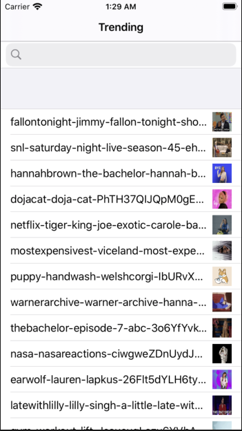

# GiphyDemo
-------------------

## By Dana Devoe

This program uses the [Giphy API](https://github.com/Giphy/GiphyAPI) to display trending animated GIFs and allows the user to search for GIFs using the API.

# How to compile the application
--------------------------------
This projects uses cocoapods to load third party libraries.
Open the Terminal and go to the directory with the podfile

Type pod install
open the workspace
compile and run the application

# List of CocoaPods
---------------------------------
* XLForm
* UIImage+animatedGif
* AFNetworking
* JSONModel
* UIGifImage

